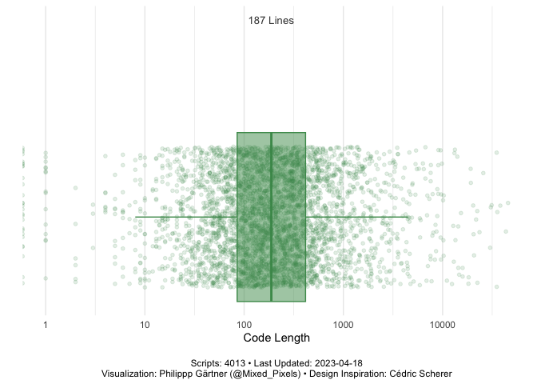
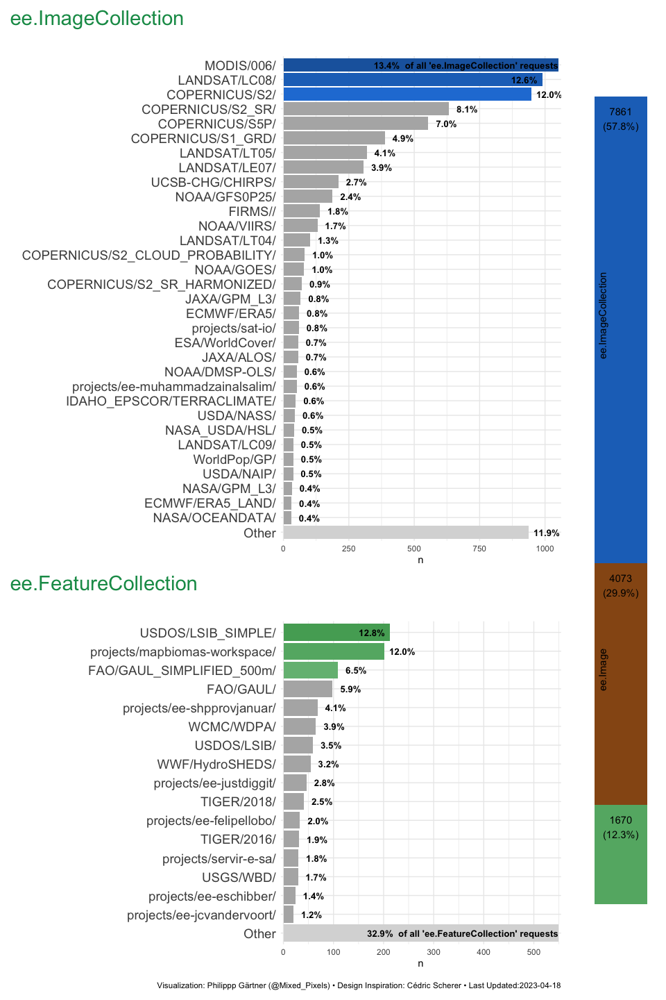
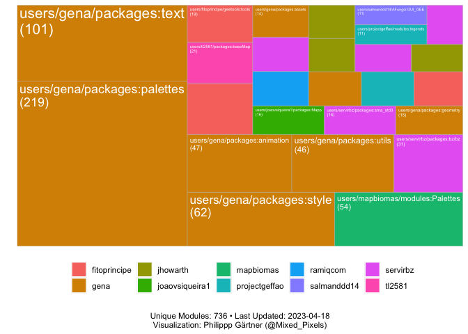
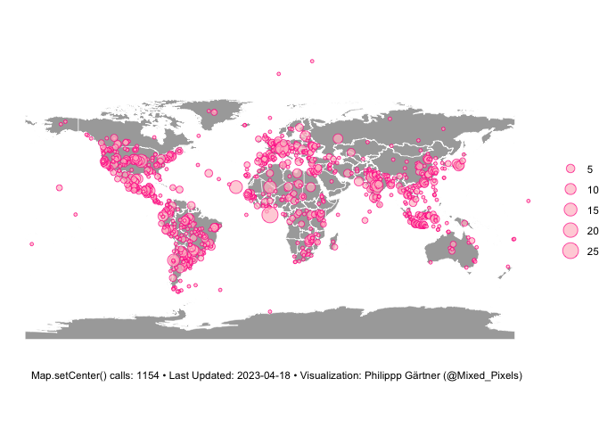

**[Earth Engine
Apps](https://developers.google.com/earth-engine/guides/apps) are
dynamic, shareable user interfaces for Earth Engine analyses. The
[ee-appshot](https://github.com/samapriya/ee-appshot) repository from
[Samapriya Roy](https://twitter.com/samapriyaroy) creates a weekly
snapshot of available Earth Engine Apps and provides their URL’s and
script source codes.**

**The ee-appshot-info repository analyzes the script source codes and
aggregates information on how creators use Earth Engine, what data they
load, and which areas they are interested in.**

App Code Length
===============

Currently, the repository contains **4021** scripts with a median of
**187** lines of code (comments excluded).

 

Usage of Common Earth Engine object classes
===========================================

ee.ImageCollections are the most important objects in Earth Engine Apps
(7894 out of 13588 object requests). The image sets of *MODIS/006/* are
the most requested, followed by *LANDSAT/LC08/+* and *Other+*.

For the ee.FeatureCollections, the
[*Other*](https://developers.google.com/earth-engine/datasets/catalog/USDOS_LSIB_SIMPLE_2017?hl=en)
dataset (Simplified International Boundary Polygons) is one of the most
popular datasets.

It is noticeable that many requested datasets do not come from the Earth
Engine data catalog but from the
[awesome-gee-community-datasets](https://samapriya.github.io/awesome-gee-community-datasets/)
collection (recognizable by the *projects*/ label)), which is also
managed by [Samapriya Roy](https://twitter.com/samapriyaroy).

Popular Script Modules
======================

It’s good practice to write [modular, reusable
code](https://developers.google.com/earth-engine/guides/playground?hl=en#script-modules)
that can be shared between scripts without extensive copying and
pasting. In total were 730 unique modules requested. The most popular
modules (+10 requests) are:

 

Areas of Interest
=================

[Map.setCenter(lon,
lat)](https://developers.google.com/earth-engine/apidocs/map-setcenter?hl=en)
centers the map view to a given coordinate pair. All Map.setCenter()
requests combined result in a world map of the community areas of
interests.

